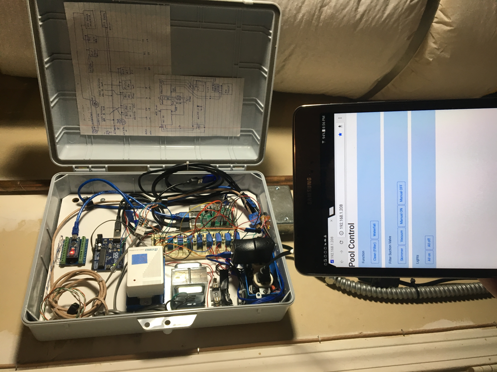

## Pool automation control prototype

This will operate x10 lighting, read water level, perform auto fill, and actuate valves as needed for cleaning or operating my waterfall.  For now automation is achieved via cron tasks and some operations are available via the ui.  I would like to add chlorene level detection, a driver for a variable speed pump, and a panel display/buttons at some point. 

<!---->
<p align="center">
  
</p>

## Basic components 

```
Raspberry PI 3
| 
+---usb--> Arduino Uno -> x10_serial -> x10 power line module -> x10 commands A01/A02/A03; on/off -> x10 pool light switches
+---usb--> Arduino Nano --analog--> ETape (water level)
+---gpio--> Relay board +-> Jandy valve actuator (vacuum/skimmer and return/waterfall) direction
|                       +-> Water valve (on/off)
|                       +-> 24VAC transformer (on/off)
|                       +-> x10 power line module (on/off)
+---cli commands(autofill/lights/valves/etape)/cron(scheduled tasks)
+---Flask py web service <- web ui
```


