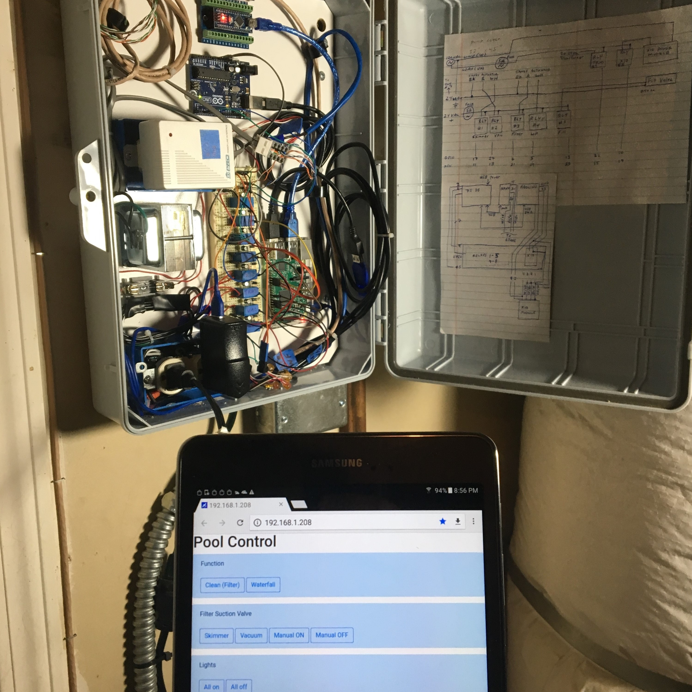

Pool automation control prototype


<p align="center">
  
</p>


```
Raspberry PI 3
| 
+---usb--> Arduino Uno -> x10_serial -> x10 power line module -> x10 commands A01/A02/A03; on/off -> x10 pool light switches
+---usb--> Arduino Nano --analog--> ETape (water level)
+---gpio--> Relay board +-> Jandy valve actuator (vacuum/skimmer and return/waterfall) direction
|                       +-> Water valve (on/off)
|                       +-> 24VAC transformer (on/off)
|                       +-> x10 power line module (on/off)
+---cli commands(autofill/lights/valves/etape)/cron(scheduled tasks)
+---Flask py web service <- web ui
```


